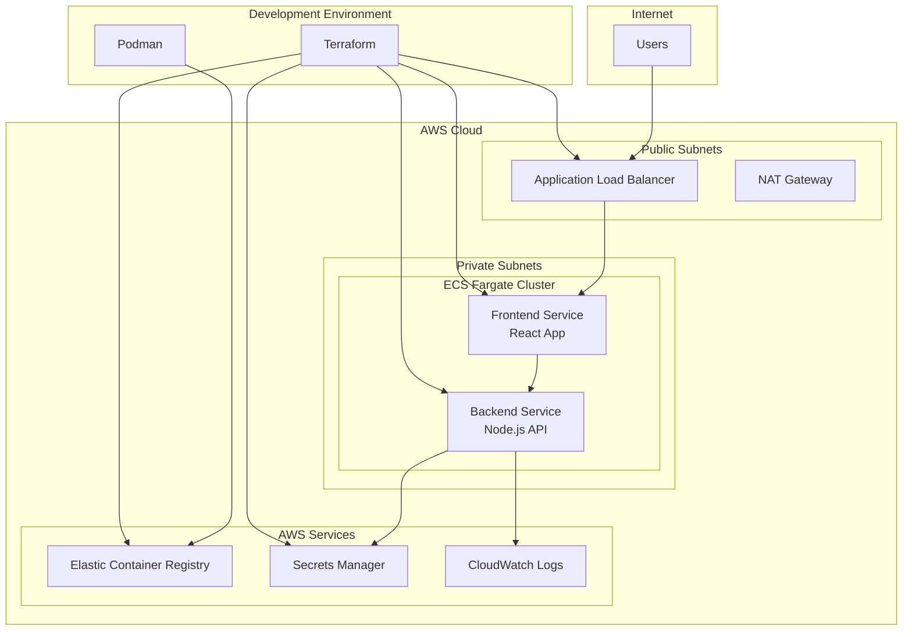

# Design Document

## Overview

This design implements a complete containerization and deployment solution for a full-stack NIST-800 Compliance Dashboard application using modern DevOps practices. The solution leverages Podman for multi-architecture container builds, Terraform for infrastructure as code, AWS ECS Fargate for serverless container orchestration, and AWS Secrets Manager for secure credential management.

The architecture follows AWS Well-Architected Framework principles, emphasizing security, reliability, and operational excellence. The frontend (React) will be publicly accessible through an Application Load Balancer, while the backend (Node.js/Express) will be privately accessible only to the frontend, with secure access to AWS services through IAM roles.

## Architecture

### High-Level Architecture



### Container Architecture

The application uses a microservices architecture with two main services:

1. **Frontend Service**: React application serving the compliance dashboard UI
2. **Backend Service**: Node.js/Express API providing data and business logic

Both services are containerized using multi-architecture Docker images built with Podman, supporting both AMD64 and ARM64 architectures for optimal performance across different deployment environments.

### Network Architecture

- **VPC**: Dedicated Virtual Private Cloud with public and private subnets across multiple AZs
- **Public Subnets**: Host the Application Load Balancer and NAT Gateway
- **Private Subnets**: Host ECS Fargate tasks for both frontend and backend services
- **Security Groups**: Implement least-privilege access controls between services
- **Service Discovery**: Internal DNS resolution for service-to-service communication

## Components and Interfaces

### 1. Container Images

#### Frontend Container
- **Base Image**: Node.js 20 official image
- **Build Process**: Multi-stage build optimizing for production
- **Exposed Port**: 3000
- **Environment Variables**: Backend API endpoint
- **Architecture Support**: linux/amd64, linux/arm64

#### Backend Container  
- **Base Image**: Node.js 20 official image
- **Dependencies**: Express, AWS SDK, OpenAI SDK, Prisma
- **Exposed Port**: 4000
- **Environment Variables**: AWS region, database connection
- **Secrets**: OpenAI API key from AWS Secrets Manager
- **Architecture Support**: linux/amd64, linux/arm64

### 2. Terraform Infrastructure Components

#### Core Infrastructure (`terraform-infra/`)
```
terraform-infra/
├── main.tf                 # Main Terraform configuration
├── variables.tf            # Input variables
├── outputs.tf             # Output values
├── providers.tf           # Provider configurations
├── vpc.tf                 # VPC and networking
├── ecr.tf                 # ECR repositories
├── ecs.tf                 # ECS cluster and services
├── iam.tf                 # IAM roles and policies
├── secrets.tf             # Secrets Manager configuration
├── security-groups.tf     # Security group rules
└── load-balancer.tf       # ALB configuration
```

#### Provider Configuration
- **AWS Provider**: For AWS resource management
- **Docker Provider (kreuzwerker/docker)**: For image building and pushing to ECR

### 3. ECS Fargate Configuration

#### Task Definitions
- **CPU/Memory**: Optimized allocations for each service
- **Network Mode**: awsvpc for enhanced security
- **Log Configuration**: CloudWatch Logs integration
- **Health Checks**: Application-level health endpoints

#### Service Configuration
- **Desired Count**: Auto-scaling based on demand
- **Deployment Configuration**: Rolling updates with health checks
- **Load Balancer Integration**: ALB target group registration
- **Service Discovery**: Internal DNS for service communication

### 4. IAM Roles and Policies

#### Task Execution Role
- **Purpose**: ECS task startup and ECR image pulling
- **Permissions**: 
  - ECR image pull
  - CloudWatch Logs creation
  - Basic ECS task execution

#### Backend Task Role
- **Purpose**: Runtime AWS service access
- **Permissions**:
  - Secrets Manager read access for OpenAI API key
  - CloudWatch Logs write access
  - Minimal required AWS Config Service access

### 5. Secrets Management

#### AWS Secrets Manager Integration
- **Secret Storage**: OpenAI API key encrypted with default KMS key
- **Access Pattern**: Runtime retrieval using AWS SDK
- **Rotation**: Support for automatic secret rotation
- **Encryption**: Default Secrets Manager KMS key

## Data Models

### Environment Configuration
```typescript
interface EnvironmentConfig {
  aws: {
    region: string;
    secretName: string;
  };
  server: {
    port: number;
    corsOrigin: string;
  };
  frontend: {
    backendUrl: string;
  };
}
```

### Secret Structure
```json
{
  "openai_api_key": "sk-...",
  "database_url": "postgresql://...",
  "additional_secrets": "..."
}
```

### Terraform Variables
```hcl
variable "environment" {
  description = "Environment name (dev, staging, prod)"
  type        = string
  default     = "dev"
}

variable "aws_region" {
  description = "AWS region for deployment"
  type        = string
  default     = "us-east-1"
}

variable "app_name" {
  description = "Application name for resource naming"
  type        = string
  default     = "nist-compliance-dashboard"
}
```

## Error Handling

### Container Build Errors
- **Multi-architecture build failures**: Fallback to single architecture with warnings
- **Dependency installation issues**: Clear error messages with resolution steps
- **Image size optimization**: Warnings for oversized images with optimization suggestions

### Deployment Errors
- **ECS task startup failures**: Detailed CloudWatch logs with troubleshooting guidance
- **Health check failures**: Automatic rollback to previous stable version
- **Resource provisioning errors**: Terraform state management and recovery procedures

### Runtime Errors
- **Secrets retrieval failures**: Graceful degradation with retry mechanisms
- **Service communication errors**: Circuit breaker patterns and fallback responses
- **AWS service unavailability**: Local caching and offline mode capabilities

### Network and Security Errors
- **Security group misconfigurations**: Validation rules and automated fixes
- **Load balancer health check failures**: Detailed diagnostics and resolution steps
- **Certificate and TLS errors**: Automated certificate management and renewal

## Testing Strategy

### Container Testing
- **Image Security Scanning**: Automated vulnerability scanning with Trivy
- **Multi-architecture Validation**: Testing on both AMD64 and ARM64 platforms
- **Container Runtime Testing**: Validation of environment variables and secrets access

### Infrastructure Testing
- **Terraform Validation**: Syntax checking and plan validation
- **Resource Provisioning Tests**: Automated testing of infrastructure deployment
- **Security Configuration Tests**: Validation of IAM policies and security groups

### Integration Testing
- **Service Communication**: End-to-end testing of frontend-backend communication
- **Secrets Access**: Validation of runtime secret retrieval
- **Load Balancer Configuration**: Testing of public accessibility and routing

### Performance Testing
- **Container Startup Time**: Optimization of image layers and startup processes
- **Resource Utilization**: CPU and memory usage optimization
- **Auto-scaling Behavior**: Testing of scaling policies and thresholds

### Security Testing
- **IAM Policy Validation**: Least-privilege access verification
- **Network Security**: Security group rule validation
- **Secrets Management**: Encryption and access pattern verification
- **Container Security**: Runtime security scanning and compliance checks

## Deployment Workflow

### Build Phase
1. **Multi-architecture Image Build**: Podman builds for AMD64 and ARM64
2. **Image Optimization**: Layer caching and size optimization
3. **Security Scanning**: Vulnerability assessment and compliance checking
4. **Image Tagging**: Version-based and latest tag management

### Infrastructure Phase
1. **Terraform Planning**: Infrastructure change preview and validation
2. **Resource Provisioning**: Automated AWS resource creation
3. **Configuration Management**: Environment-specific parameter handling
4. **State Management**: Terraform state backup and recovery

### Deployment Phase
1. **ECR Image Push**: Secure image upload to container registry
2. **ECS Service Update**: Rolling deployment with health checks
3. **Load Balancer Configuration**: Traffic routing and SSL termination
4. **Monitoring Setup**: CloudWatch dashboards and alerting

### Validation Phase
1. **Health Check Validation**: Service availability verification
2. **Integration Testing**: End-to-end functionality validation
3. **Performance Monitoring**: Resource utilization and response time tracking
4. **Security Validation**: Access control and encryption verification